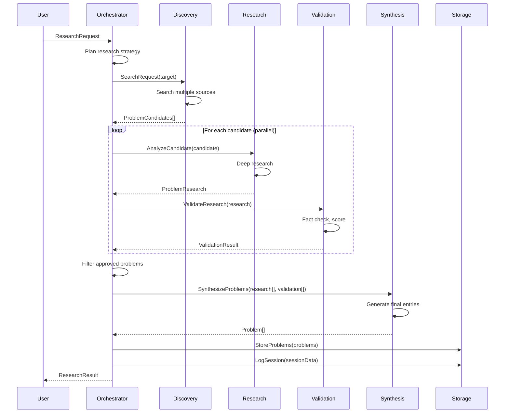

# Agentic Problem Discovery Flow

**Version**: 1.0.0
**Status**: Design Specification
**Last Updated**: 2026-01-20

---

## Overview

This document defines the agentic workflow for automatically discovering, analyzing, and cataloging industry problems. The system uses a multi-agent architecture where specialized agents collaborate to produce high-quality, well-researched problem entries.

---

## Architecture Overview

```
┌─────────────────────────────────────────────────────────────────────────┐
│                        ORCHESTRATOR AGENT                                │
│                   (Coordinates entire research flow)                     │
└─────────────────────────┬───────────────────────────────────────────────┘
                          │
        ┌─────────────────┼─────────────────┐
        │                 │                 │
        ▼                 ▼                 ▼
┌───────────────┐ ┌───────────────┐ ┌───────────────┐
│   DISCOVERY   │ │   RESEARCH    │ │  VALIDATION   │
│    AGENT      │ │    AGENT      │ │    AGENT      │
│               │ │               │ │               │
│ - Web search  │ │ - Deep dive   │ │ - Fact check  │
│ - Source find │ │ - Analysis    │ │ - Scoring     │
│ - Trending    │ │ - Structure   │ │ - Dedup       │
└───────────────┘ └───────────────┘ └───────────────┘
        │                 │                 │
        │                 │                 │
        ▼                 ▼                 ▼
┌─────────────────────────────────────────────────────────────────────────┐
│                         SYNTHESIS AGENT                                  │
│              (Combines results, generates final output)                  │
└─────────────────────────────────────────────────────────────────────────┘
                          │
                          ▼
                 ┌─────────────────┐
                 │  JSON OUTPUT    │
                 │  (Schema-valid) │
                 └─────────────────┘
```

---

## Agent Definitions

### 1. Orchestrator Agent

The master coordinator that manages the research workflow.

**Responsibilities**:
- Accept research requests (industry, domain, field)
- Plan research strategy based on scope
- Coordinate agent execution
- Handle errors and retries
- Track progress and metrics
- Manage research sessions

**System Prompt**:
```
You are the Research Orchestrator for Problem Matters, a platform that catalogs
industry problems. Your role is to coordinate a team of specialized agents to
discover and document problems in specified industries/domains.

For each research request, you will:
1. Analyze the scope and plan the research approach
2. Dispatch the Discovery Agent to find problem candidates
3. Send candidates to the Research Agent for deep analysis
4. Have the Validation Agent verify and score results
5. Use the Synthesis Agent to produce final schema-valid output

Maintain high quality standards:
- Every problem must have verifiable sources
- Avoid duplicate or trivial problems
- Focus on significant, impactful challenges
- Ensure proper taxonomy classification

Track all activities for the research session log.
```

**Input Schema**:
```typescript
interface ResearchRequest {
  target: {
    industry: string;        // Required: industry name/slug
    domain?: string;         // Optional: specific domain
    field?: string;          // Optional: specific field
    specificTopic?: string;  // Optional: narrow focus
  };
  configuration: {
    maxProblems: number;     // Target number of problems (default: 20)
    minConfidence: number;   // Minimum confidence threshold (default: 0.7)
    depthLevel: 'shallow' | 'standard' | 'deep' | 'exhaustive';
    sourcesRequired: boolean; // Require verifiable sources (default: true)
    includeExisting: boolean; // Consider existing solutions (default: true)
  };
  context?: {
    existingProblemIds?: string[]; // IDs to avoid duplicating
    priorityKeywords?: string[];   // Topics to emphasize
    excludeKeywords?: string[];    // Topics to avoid
  };
}
```

### 2. Discovery Agent

Searches for problem candidates across multiple sources.

**Responsibilities**:
- Web search for industry challenges
- Academic database queries
- News and media analysis
- Community forum mining
- Industry report extraction
- Patent/research gap identification

**System Prompt**:
```
You are the Discovery Agent for Problem Matters. Your role is to search for
and identify potential industry problems that merit documentation.

Search Strategy:
1. Query multiple source types for the target domain
2. Look for patterns indicating real challenges:
   - Complaints and frustrations
   - Research gaps
   - Failed or inadequate solutions
   - Recurring issues
   - Emerging concerns
3. Filter out noise and irrelevant content
4. Prioritize recent and trending issues

Source Types to Query:
- Web search (general + industry-specific)
- Academic papers and preprints
- Industry news and publications
- Professional forums and communities
- Patent databases (for innovation gaps)
- Government/regulatory reports
- Conference proceedings

For each candidate problem, extract:
- Brief description of the problem
- Source URL/reference
- Indication of problem significance
- Affected stakeholders
- Time reference (when discovered/trending)

Output candidates ranked by apparent significance and novelty.
```

**Tools Available**:
- `web_search`: General web search
- `academic_search`: Academic database search (arXiv, IEEE, ACM)
- `news_search`: News aggregator search
- `forum_search`: Search Stack Overflow, Reddit, industry forums
- `patent_search`: USPTO/EPO patent search

**Output Schema**:
```typescript
interface ProblemCandidate {
  id: string;                    // Temporary ID
  title: string;                 // Concise problem title
  briefDescription: string;      // 1-2 sentence description
  sourceUrl: string;             // Primary source
  sourceType: string;            // academic, news, forum, etc.
  discoveryDate: string;         // When discovered
  significanceIndicators: {
    mentionCount: number;        // Approximate mentions found
    recentActivity: boolean;     // Active in last 6 months
    authoritySource: boolean;    // From authoritative source
    quantifiedImpact?: string;   // Any numeric impact cited
  };
  suggestedTaxonomy: {
    industry: string;
    domain: string;
    field?: string;
  };
  rawExcerpts: string[];         // Relevant text excerpts from sources
  relatedSearchTerms: string[];  // For Research Agent follow-up
}
```

### 3. Research Agent

Conducts deep analysis on problem candidates.

**Responsibilities**:
- Deep dive into each problem candidate
- Gather comprehensive evidence
- Identify root causes and consequences
- Find existing solutions and gaps
- Map stakeholders
- Collect metrics and data points
- Structure information per schema

**System Prompt**:
```
You are the Research Agent for Problem Matters. Your role is to conduct
deep research on problem candidates and produce comprehensive analyses.

For each problem candidate, investigate:

1. PROBLEM DEFINITION
   - Clear, precise description
   - Scope and boundaries
   - Historical context

2. ROOT CAUSES
   - Technical factors
   - Organizational factors
   - Economic factors
   - Regulatory factors
   - Cultural/social factors

3. CONSEQUENCES
   - Direct impacts
   - Indirect/cascading effects
   - Short-term vs long-term
   - Quantified impacts where possible

4. EXISTING SOLUTIONS
   - Current approaches
   - Their effectiveness
   - Their limitations
   - Adoption levels

5. SOLUTION GAPS
   - What's missing
   - Why gaps exist
   - Opportunity areas

6. STAKEHOLDERS
   - Who is affected
   - Who could solve it
   - Who has influence

7. METRICS
   - Economic impact estimates
   - Affected population
   - Trend direction
   - Research activity

Always cite sources for claims. Distinguish between:
- Verified facts
- Expert opinions
- Estimated/extrapolated data
- Unverified claims
```

**Tools Available**:
- `web_fetch`: Fetch and analyze web pages
- `web_search`: Follow-up searches
- `academic_search`: Deep academic research
- `calculate`: Perform calculations
- `extract_data`: Extract structured data from text

**Output Schema**:
```typescript
interface ProblemResearch {
  candidateId: string;

  problem: {
    title: string;
    description: string;
    summary: string;
    historicalContext?: string;
  };

  taxonomy: {
    industry: { name: string; slug: string };
    domain: { name: string; slug: string };
    field?: { name: string; slug: string };
    subfield?: { name: string; slug: string };
  };

  classification: {
    problemType: ProblemType;
    problemSubtypes: string[];
    scope: Scope;
    maturity: Maturity;
    urgency: Urgency;
  };

  rootCauses: Array<{
    description: string;
    category: string;
    contributionLevel: string;
    evidence: string;
  }>;

  consequences: Array<{
    description: string;
    type: string;
    affectedArea: string;
    timeframe: string;
    evidence: string;
  }>;

  existingSolutions: Array<{
    name: string;
    description: string;
    type: string;
    effectiveness: number;
    adoption: string;
    limitations: string[];
    url?: string;
  }>;

  solutionGaps: Array<{
    description: string;
    gapType: string;
    opportunity: string;
    difficulty: string;
  }>;

  stakeholders: Array<{
    type: string;
    description: string;
    examples: string[];
    interest: string;
    influence: string;
  }>;

  metrics: {
    economicImpactUSD?: number;
    affectedPopulation?: string;
    affectedOrganizations?: string;
    academicPapers?: number;
    trendDirection: string;
    searchVolume?: number;
  };

  sources: Array<{
    type: string;
    title: string;
    authors?: string[];
    url: string;
    publishedAt?: string;
    publisher?: string;
    relevantExcerpt: string;
  }>;

  researchNotes: string;
  confidenceAssessment: {
    overall: number;
    evidenceQuality: string;
    dataGaps: string[];
  };
}
```

### 4. Validation Agent

Verifies research quality and assigns scores.

**Responsibilities**:
- Fact-check key claims
- Verify source credibility
- Detect duplicate problems
- Calculate impact scores
- Assess confidence levels
- Check schema compliance
- Quality gate decisions

**System Prompt**:
```
You are the Validation Agent for Problem Matters. Your role is to ensure
research quality and assign accurate scores to problem entries.

Validation Tasks:

1. FACT CHECKING
   - Verify key claims against sources
   - Check statistics are reasonable
   - Confirm organizations/people exist
   - Flag unverifiable claims

2. SOURCE CREDIBILITY
   - Assess source reliability (0-1)
   - Check publication reputation
   - Verify recency
   - Flag potentially biased sources

3. DUPLICATE DETECTION
   - Compare against existing problems
   - Identify if this is a subset of another
   - Check for semantic similarity
   - Decide: unique, merge, or reject

4. SCORING
   Calculate scores (0-10) for:

   SEVERITY:
   - Affected population scale
   - Economic impact magnitude
   - Quality of life impact
   - Productivity impact

   TRACTABILITY:
   - Technical feasibility
   - Resource requirements (inverse)
   - Existing progress
   - Barrier count (inverse)

   NEGLECTEDNESS:
   - Research activity (inverse)
   - Funding level (inverse)
   - Organization count (inverse)
   - Media attention (inverse)

   IMPACT SCORE (composite):
   = (Severity * 0.35) + (Tractability * 0.25) + (Neglectedness * 0.25) + (Urgency * 0.15)

5. CONFIDENCE ASSESSMENT
   - Evidence strength
   - Source diversity
   - Data recency
   - Consensus level

Return validation result with scores or rejection reason.
```

**Tools Available**:
- `web_fetch`: Verify source URLs
- `similarity_check`: Check against existing problems
- `calculate`: Score calculations

**Output Schema**:
```typescript
interface ValidationResult {
  candidateId: string;

  verdict: 'approved' | 'approved_with_edits' | 'needs_more_research' | 'rejected';
  rejectionReason?: string;

  factCheckResults: Array<{
    claim: string;
    verified: boolean;
    source?: string;
    note?: string;
  }>;

  sourceCredibility: Array<{
    sourceUrl: string;
    credibilityScore: number;
    issues?: string[];
  }>;

  duplicateCheck: {
    isDuplicate: boolean;
    similarProblemIds?: string[];
    similarity?: number;
    recommendation: 'unique' | 'merge' | 'reject';
  };

  scores: {
    severity: {
      overall: number;
      affectedPopulation: number;
      economicImpact: number;
      qualityOfLife: number;
      productivity: number;
    };
    tractability: {
      overall: number;
      technicalFeasibility: number;
      resourceRequirements: number;
      existingProgress: number;
    };
    neglectedness: {
      overall: number;
      attentionLevel: string;
    };
    impactScore: number;
  };

  confidence: {
    overall: number;
    evidenceQuality: 'strong' | 'moderate' | 'weak';
    concerns: string[];
  };

  suggestedEdits?: Array<{
    field: string;
    originalValue: any;
    suggestedValue: any;
    reason: string;
  }>;
}
```

### 5. Synthesis Agent

Produces the final schema-valid output.

**Responsibilities**:
- Merge research and validation
- Generate final problem entries
- Ensure schema compliance
- Optimize text quality
- Generate slugs and IDs
- Calculate final metadata

**System Prompt**:
```
You are the Synthesis Agent for Problem Matters. Your role is to produce
final, schema-valid problem entries from research and validation results.

Your tasks:

1. MERGE INPUTS
   - Combine research content with validation scores
   - Apply suggested edits from validation
   - Resolve any inconsistencies

2. TEXT OPTIMIZATION
   - Ensure clear, professional writing
   - Remove redundancy
   - Standardize terminology
   - Appropriate length for each field

3. GENERATE IDENTIFIERS
   - Create UUID for problem ID
   - Generate URL-friendly slug from title
   - Link related problems by ID

4. SCHEMA COMPLIANCE
   - Validate against JSON schema
   - Ensure all required fields present
   - Check field constraints (min/max length, enums)
   - Format dates as ISO 8601

5. METADATA
   - Set timestamps
   - Initialize version number
   - Set verification status
   - Add research session reference

Output must be valid against the problem.schema.json specification.
```

**Output Schema**:
The final `Problem` object as defined in the research-result-schema.md

---

## Flow Execution

### Standard Flow



### Parallel Execution Strategy

For efficiency, the system executes in parallel where possible:

```
Phase 1: Discovery (Serial)
└── Single discovery pass for the target domain

Phase 2: Research + Validation (Parallel)
├── Candidate 1 → Research → Validation
├── Candidate 2 → Research → Validation
├── Candidate 3 → Research → Validation
└── ... (up to 5 concurrent)

Phase 3: Synthesis (Serial)
└── Batch process all approved problems
```

---

## Implementation

### Orchestrator Implementation

```typescript
// agents/orchestrator.ts

import { v4 as uuid } from 'uuid';
import { DiscoveryAgent } from './discovery';
import { ResearchAgent } from './research';
import { ValidationAgent } from './validation';
import { SynthesisAgent } from './synthesis';
import { ResearchSession, Problem } from '@/types/research';

interface ResearchRequest {
  target: {
    industry: string;
    domain?: string;
    field?: string;
    specificTopic?: string;
  };
  configuration: {
    maxProblems: number;
    minConfidence: number;
    depthLevel: 'shallow' | 'standard' | 'deep' | 'exhaustive';
    sourcesRequired: boolean;
  };
  context?: {
    existingProblemIds?: string[];
    priorityKeywords?: string[];
  };
}

interface ResearchResult {
  session: ResearchSession;
  problems: Problem[];
  errors: Error[];
}

export class OrchestratorAgent {
  private discovery: DiscoveryAgent;
  private research: ResearchAgent;
  private validation: ValidationAgent;
  private synthesis: SynthesisAgent;

  constructor(config: AgentConfig) {
    this.discovery = new DiscoveryAgent(config);
    this.research = new ResearchAgent(config);
    this.validation = new ValidationAgent(config);
    this.synthesis = new SynthesisAgent(config);
  }

  async executeResearch(request: ResearchRequest): Promise<ResearchResult> {
    const sessionId = uuid();
    const session: ResearchSession = {
      id: sessionId,
      startedAt: new Date().toISOString(),
      target: request.target,
      configuration: request.configuration,
      status: 'in-progress',
      steps: [],
      errors: []
    };

    const problems: Problem[] = [];
    const errors: Error[] = [];

    try {
      // Step 1: Discovery
      this.logStep(session, 'discovery', 'started');
      const candidates = await this.discovery.findCandidates({
        target: request.target,
        maxCandidates: Math.ceil(request.configuration.maxProblems * 1.5),
        depthLevel: request.configuration.depthLevel
      });
      this.logStep(session, 'discovery', 'completed', {
        candidatesFound: candidates.length
      });

      // Step 2: Research + Validation (parallel)
      const researchResults = await this.processInParallel(
        candidates,
        async (candidate) => {
          try {
            // Research phase
            const research = await this.research.analyze(candidate, {
              depthLevel: request.configuration.depthLevel,
              sourcesRequired: request.configuration.sourcesRequired
            });

            // Validation phase
            const validation = await this.validation.validate(research, {
              existingProblemIds: request.context?.existingProblemIds,
              minConfidence: request.configuration.minConfidence
            });

            return { candidate, research, validation };
          } catch (error) {
            errors.push(error as Error);
            return null;
          }
        },
        5 // Max concurrent
      );

      // Filter approved results
      const approvedResults = researchResults.filter(
        r => r !== null &&
        (r.validation.verdict === 'approved' ||
         r.validation.verdict === 'approved_with_edits')
      );

      this.logStep(session, 'research-validation', 'completed', {
        processed: researchResults.length,
        approved: approvedResults.length
      });

      // Step 3: Synthesis
      if (approvedResults.length > 0) {
        const synthesizedProblems = await this.synthesis.synthesize(
          approvedResults.slice(0, request.configuration.maxProblems),
          sessionId
        );
        problems.push(...synthesizedProblems);
      }

      this.logStep(session, 'synthesis', 'completed', {
        problemsGenerated: problems.length
      });

      // Finalize session
      session.completedAt = new Date().toISOString();
      session.status = 'completed';
      session.results = {
        problemsDiscovered: candidates.length,
        problemsStored: problems.length,
        duplicatesSkipped: researchResults.filter(
          r => r?.validation.duplicateCheck.isDuplicate
        ).length,
        lowConfidenceSkipped: researchResults.filter(
          r => r?.validation.confidence.overall < request.configuration.minConfidence
        ).length,
        problemIds: problems.map(p => p.id)
      };

    } catch (error) {
      session.status = 'failed';
      session.errors.push({
        timestamp: new Date().toISOString(),
        message: (error as Error).message,
        recoverable: false,
        recovered: false
      });
      errors.push(error as Error);
    }

    return { session, problems, errors };
  }

  private async processInParallel<T, R>(
    items: T[],
    processor: (item: T) => Promise<R>,
    maxConcurrent: number
  ): Promise<R[]> {
    const results: R[] = [];
    const executing: Promise<void>[] = [];

    for (const item of items) {
      const promise = processor(item).then(result => {
        results.push(result);
      });

      executing.push(promise);

      if (executing.length >= maxConcurrent) {
        await Promise.race(executing);
        executing.splice(
          executing.findIndex(p => p === promise),
          1
        );
      }
    }

    await Promise.all(executing);
    return results;
  }

  private logStep(
    session: ResearchSession,
    action: string,
    status: string,
    output?: object
  ) {
    session.steps.push({
      step: session.steps.length + 1,
      action,
      timestamp: new Date().toISOString(),
      status,
      output
    });
  }
}
```

### Discovery Agent Implementation

```typescript
// agents/discovery.ts

import Anthropic from '@anthropic-ai/sdk';
import { WebSearchTool, AcademicSearchTool } from '@/tools';

interface SearchRequest {
  target: {
    industry: string;
    domain?: string;
    field?: string;
    specificTopic?: string;
  };
  maxCandidates: number;
  depthLevel: string;
}

interface ProblemCandidate {
  id: string;
  title: string;
  briefDescription: string;
  sourceUrl: string;
  sourceType: string;
  discoveryDate: string;
  significanceIndicators: {
    mentionCount: number;
    recentActivity: boolean;
    authoritySource: boolean;
    quantifiedImpact?: string;
  };
  suggestedTaxonomy: {
    industry: string;
    domain: string;
    field?: string;
  };
  rawExcerpts: string[];
  relatedSearchTerms: string[];
}

export class DiscoveryAgent {
  private client: Anthropic;
  private webSearch: WebSearchTool;
  private academicSearch: AcademicSearchTool;

  constructor(config: AgentConfig) {
    this.client = new Anthropic();
    this.webSearch = new WebSearchTool();
    this.academicSearch = new AcademicSearchTool();
  }

  async findCandidates(request: SearchRequest): Promise<ProblemCandidate[]> {
    const searchQueries = this.generateSearchQueries(request);
    const allResults: SearchResult[] = [];

    // Execute searches in parallel
    const searchPromises = searchQueries.map(async (query) => {
      const webResults = await this.webSearch.search(query.query, {
        maxResults: 20,
        recency: query.recency
      });

      const academicResults = await this.academicSearch.search(query.query, {
        maxResults: 10,
        years: 5
      });

      return [...webResults, ...academicResults];
    });

    const results = await Promise.all(searchPromises);
    results.forEach(r => allResults.push(...r));

    // Use Claude to extract problem candidates from search results
    const candidates = await this.extractCandidates(allResults, request);

    // Deduplicate and rank
    const rankedCandidates = this.rankAndDeduplicate(candidates);

    return rankedCandidates.slice(0, request.maxCandidates);
  }

  private generateSearchQueries(request: SearchRequest): SearchQuery[] {
    const base = request.target.specificTopic ||
                 request.target.field ||
                 request.target.domain ||
                 request.target.industry;

    return [
      // Problem-focused queries
      { query: `${base} challenges problems issues`, recency: 'year' },
      { query: `${base} pain points frustrations`, recency: 'year' },
      { query: `${base} unsolved problems research gaps`, recency: '2years' },

      // Industry-specific queries
      { query: `${base} industry report challenges 2025 2026`, recency: '6months' },
      { query: `${base} market problems opportunities`, recency: 'year' },

      // Technical queries
      { query: `${base} technical limitations bottlenecks`, recency: 'year' },
      { query: `${base} scalability issues performance problems`, recency: 'year' },

      // Future-focused queries
      { query: `${base} emerging challenges future risks`, recency: '6months' },
      { query: `${base} trends concerns 2026`, recency: '3months' }
    ];
  }

  private async extractCandidates(
    results: SearchResult[],
    request: SearchRequest
  ): Promise<ProblemCandidate[]> {
    const prompt = `
Analyze these search results and extract distinct problem candidates for the
${request.target.industry} industry${request.target.domain ? `, ${request.target.domain} domain` : ''}.

Search Results:
${results.map(r => `
Title: ${r.title}
URL: ${r.url}
Snippet: ${r.snippet}
Source Type: ${r.sourceType}
Date: ${r.date}
`).join('\n---\n')}

For each distinct problem identified, output a JSON object with:
- id: temporary unique ID (e.g., "candidate-1")
- title: concise problem title (10-15 words)
- briefDescription: 1-2 sentence description
- sourceUrl: primary source URL
- sourceType: academic, news, forum, industry-report, etc.
- discoveryDate: ISO date
- significanceIndicators: object with mentionCount, recentActivity, authoritySource, quantifiedImpact
- suggestedTaxonomy: industry, domain, field
- rawExcerpts: relevant text excerpts
- relatedSearchTerms: terms for follow-up research

Focus on:
- Real, significant problems (not trivial issues)
- Problems with evidence of impact
- Problems not already well-solved
- Avoid marketing content or vendor pitches

Output as a JSON array of problem candidates.
`;

    const response = await this.client.messages.create({
      model: 'claude-sonnet-4-20250514',
      max_tokens: 4096,
      messages: [{ role: 'user', content: prompt }]
    });

    // Parse JSON from response
    const content = response.content[0];
    if (content.type === 'text') {
      const jsonMatch = content.text.match(/\[[\s\S]*\]/);
      if (jsonMatch) {
        return JSON.parse(jsonMatch[0]);
      }
    }

    return [];
  }

  private rankAndDeduplicate(
    candidates: ProblemCandidate[]
  ): ProblemCandidate[] {
    // Remove near-duplicates using title similarity
    const unique: ProblemCandidate[] = [];

    for (const candidate of candidates) {
      const isDuplicate = unique.some(
        existing => this.titleSimilarity(existing.title, candidate.title) > 0.7
      );

      if (!isDuplicate) {
        unique.push(candidate);
      }
    }

    // Rank by significance
    return unique.sort((a, b) => {
      const scoreA = this.calculateSignificanceScore(a);
      const scoreB = this.calculateSignificanceScore(b);
      return scoreB - scoreA;
    });
  }

  private titleSimilarity(a: string, b: string): number {
    const wordsA = new Set(a.toLowerCase().split(/\s+/));
    const wordsB = new Set(b.toLowerCase().split(/\s+/));
    const intersection = new Set([...wordsA].filter(x => wordsB.has(x)));
    const union = new Set([...wordsA, ...wordsB]);
    return intersection.size / union.size;
  }

  private calculateSignificanceScore(candidate: ProblemCandidate): number {
    let score = 0;

    if (candidate.significanceIndicators.authoritySource) score += 3;
    if (candidate.significanceIndicators.recentActivity) score += 2;
    if (candidate.significanceIndicators.quantifiedImpact) score += 2;
    score += Math.min(candidate.significanceIndicators.mentionCount / 10, 3);

    return score;
  }
}
```

### Research Agent Implementation

```typescript
// agents/research.ts

import Anthropic from '@anthropic-ai/sdk';

interface AnalysisOptions {
  depthLevel: string;
  sourcesRequired: boolean;
}

export class ResearchAgent {
  private client: Anthropic;

  constructor(config: AgentConfig) {
    this.client = new Anthropic();
  }

  async analyze(
    candidate: ProblemCandidate,
    options: AnalysisOptions
  ): Promise<ProblemResearch> {
    // First, gather additional information
    const additionalSources = await this.gatherSources(candidate);

    // Deep analysis with Claude
    const analysis = await this.performAnalysis(
      candidate,
      additionalSources,
      options
    );

    return analysis;
  }

  private async gatherSources(candidate: ProblemCandidate): Promise<Source[]> {
    const sources: Source[] = [];

    // Fetch the primary source
    if (candidate.sourceUrl) {
      const content = await this.fetchUrl(candidate.sourceUrl);
      if (content) {
        sources.push({
          type: candidate.sourceType,
          title: candidate.title,
          url: candidate.sourceUrl,
          content
        });
      }
    }

    // Search for additional sources using related terms
    for (const term of candidate.relatedSearchTerms.slice(0, 3)) {
      const results = await this.webSearch.search(term, { maxResults: 5 });
      for (const result of results) {
        const content = await this.fetchUrl(result.url);
        if (content) {
          sources.push({
            type: result.sourceType,
            title: result.title,
            url: result.url,
            content: content.slice(0, 5000) // Limit content size
          });
        }
      }
    }

    return sources.slice(0, 10); // Limit to 10 sources
  }

  private async performAnalysis(
    candidate: ProblemCandidate,
    sources: Source[],
    options: AnalysisOptions
  ): Promise<ProblemResearch> {
    const depthInstructions = {
      shallow: 'Provide a brief analysis with key points only.',
      standard: 'Provide a balanced analysis covering all major aspects.',
      deep: 'Provide a thorough analysis with detailed evidence.',
      exhaustive: 'Provide the most comprehensive analysis possible with extensive detail.'
    };

    const prompt = `
Analyze this industry problem candidate and produce a comprehensive research report.

PROBLEM CANDIDATE:
Title: ${candidate.title}
Brief Description: ${candidate.briefDescription}
Taxonomy: ${JSON.stringify(candidate.suggestedTaxonomy)}

SOURCE MATERIALS:
${sources.map(s => `
--- ${s.title} (${s.type}) ---
URL: ${s.url}
Content:
${s.content}
`).join('\n')}

ANALYSIS DEPTH: ${depthInstructions[options.depthLevel]}

Produce a research report with these sections:

1. PROBLEM DEFINITION
   - Refined title (concise, descriptive)
   - Full description (200-500 words)
   - Summary (50-100 words)
   - Historical context if relevant

2. TAXONOMY CLASSIFICATION
   - Industry name and slug
   - Domain name and slug
   - Field name and slug (if applicable)
   - Subfield (if applicable)

3. PROBLEM CLASSIFICATION
   - problemType: one of [technical, process, resource, knowledge, coordination, regulatory, market, environmental, social, ethical]
   - problemSubtypes: additional tags
   - scope: one of [individual, team, organization, industry, global]
   - maturity: one of [emerging, growing, mature, declining]
   - urgency: one of [critical, high, medium, low]

4. ROOT CAUSES (3-7 causes)
   For each:
   - description
   - category: [technical, organizational, economic, regulatory, cultural, environmental]
   - contributionLevel: [primary, secondary, contributing]
   - evidence from sources

5. CONSEQUENCES (3-7 consequences)
   For each:
   - description
   - type: [direct, indirect, cascading]
   - affectedArea
   - timeframe: [immediate, short-term, medium-term, long-term]
   - evidence

6. EXISTING SOLUTIONS (2-5 solutions)
   For each:
   - name
   - description
   - type: [tool, methodology, framework, product, service, policy, standard]
   - effectiveness (1-10)
   - adoption: [experimental, early, growing, mainstream, declining]
   - limitations (list)
   - url if available

7. SOLUTION GAPS (2-5 gaps)
   For each:
   - description
   - gapType: [coverage, quality, accessibility, cost, integration, scale, awareness]
   - opportunity description
   - difficulty: [low, medium, high, very-high]

8. STAKEHOLDERS (3-6 stakeholders)
   For each:
   - type: [affected, contributor, decision-maker, funder, expert]
   - description
   - examples (list)
   - interest: [low, medium, high]
   - influence: [low, medium, high]

9. METRICS (best estimates)
   - economicImpactUSD (annual)
   - affectedPopulation
   - affectedOrganizations
   - academicPapers (last 5 years)
   - trendDirection: [increasing, stable, decreasing]
   - searchVolume (monthly estimate)

10. SOURCES
    List all sources used with:
    - type, title, authors, url, publishedAt, publisher, relevantExcerpt

11. RESEARCH NOTES
    - Key uncertainties
    - Data gaps
    - Suggestions for further research

12. CONFIDENCE ASSESSMENT
    - overall: 0-1 score
    - evidenceQuality: [strong, moderate, weak]
    - dataGaps: list of missing information

Output as a JSON object matching the ProblemResearch schema.
`;

    const response = await this.client.messages.create({
      model: 'claude-sonnet-4-20250514',
      max_tokens: 8192,
      messages: [{ role: 'user', content: prompt }]
    });

    const content = response.content[0];
    if (content.type === 'text') {
      const jsonMatch = content.text.match(/\{[\s\S]*\}/);
      if (jsonMatch) {
        const research = JSON.parse(jsonMatch[0]);
        research.candidateId = candidate.id;
        return research;
      }
    }

    throw new Error('Failed to parse research output');
  }
}
```

---

## Configuration

### Agent Configuration

```yaml
# config/agents.yaml

orchestrator:
  model: claude-sonnet-4-20250514
  max_concurrent_research: 5
  timeout_ms: 300000
  retry_attempts: 3

discovery:
  model: claude-sonnet-4-20250514
  max_search_queries: 12
  sources:
    - web_search
    - academic_search
    - news_search
    - forum_search

research:
  model: claude-sonnet-4-20250514
  max_sources_per_problem: 10
  max_content_per_source: 5000
  depth_token_limits:
    shallow: 2048
    standard: 4096
    deep: 8192
    exhaustive: 16384

validation:
  model: claude-sonnet-4-20250514
  duplicate_similarity_threshold: 0.75
  min_source_credibility: 0.5
  min_confidence_threshold: 0.7

synthesis:
  model: claude-sonnet-4-20250514
  schema_validation: strict
```

### Environment Variables

```bash
# .env

# API Keys
ANTHROPIC_API_KEY=sk-ant-...

# Search APIs
TAVILY_API_KEY=tvly-...
SERPER_API_KEY=...
SEMANTIC_SCHOLAR_API_KEY=...

# Configuration
MAX_CONCURRENT_AGENTS=5
DEFAULT_DEPTH_LEVEL=standard
MIN_CONFIDENCE_THRESHOLD=0.7

# Storage
RESEARCH_DATA_PATH=./research-data
SESSION_LOG_PATH=./sessions
```

---

## Usage Examples

### CLI Usage

```bash
# Basic research request
npx problem-research \
  --industry "technology-software" \
  --domain "software-engineering" \
  --max-problems 20 \
  --depth standard

# Focused research
npx problem-research \
  --industry "healthcare" \
  --domain "medical-devices" \
  --field "diagnostic-equipment" \
  --specific-topic "AI diagnostic accuracy" \
  --depth deep \
  --max-problems 10

# Exhaustive research
npx problem-research \
  --industry "energy" \
  --depth exhaustive \
  --max-problems 50 \
  --output ./research-output/energy
```

### Programmatic Usage

```typescript
import { OrchestratorAgent } from '@/agents/orchestrator';

const orchestrator = new OrchestratorAgent({
  apiKey: process.env.ANTHROPIC_API_KEY
});

const result = await orchestrator.executeResearch({
  target: {
    industry: 'financial-services',
    domain: 'banking',
    field: 'digital-banking'
  },
  configuration: {
    maxProblems: 15,
    minConfidence: 0.75,
    depthLevel: 'deep',
    sourcesRequired: true
  }
});

console.log(`Discovered ${result.problems.length} problems`);
console.log(`Session ID: ${result.session.id}`);
```

---

## Quality Assurance

### Automated Checks

1. **Schema Validation**: Every output validated against JSON schema
2. **Source Verification**: URLs checked for accessibility
3. **Duplicate Detection**: Semantic similarity checking
4. **Score Sanity**: Scores within expected ranges
5. **Completeness**: Required fields populated

### Human Review Workflow

```
1. Research Session Complete
        │
        ▼
2. Auto-validation Pass?
   ├── No → Flag for review
   │
   └── Yes
        │
        ▼
3. Confidence > 0.85?
   ├── Yes → Auto-publish (ai-verified)
   │
   └── No
        │
        ▼
4. Queue for human review
        │
        ▼
5. Human reviewer checks:
   - Accuracy of claims
   - Source quality
   - Score appropriateness
   - Writing quality
        │
        ▼
6. Approve → human-verified
   or
   Reject/Edit → feedback loop
```

---

## Monitoring & Metrics

### Session Metrics

- Duration per session
- Problems discovered vs stored
- Duplicate rate
- Confidence distribution
- Error rate
- Token usage

### Quality Metrics

- Source credibility average
- Verification pass rate
- Human review override rate
- Score calibration accuracy

### System Metrics

- API latency
- Rate limit utilization
- Cost per problem
- Throughput (problems/hour)

---

## Cost Estimation

| Component | Per Problem (est.) |
|-----------|-------------------|
| Discovery (search APIs) | $0.02 |
| Discovery (Claude) | $0.05 |
| Research (Claude) | $0.15 |
| Validation (Claude) | $0.05 |
| Synthesis (Claude) | $0.03 |
| **Total** | **~$0.30/problem** |

At scale (10,000 problems):
- Initial research: ~$3,000
- Quarterly refresh (20%): ~$600/quarter
